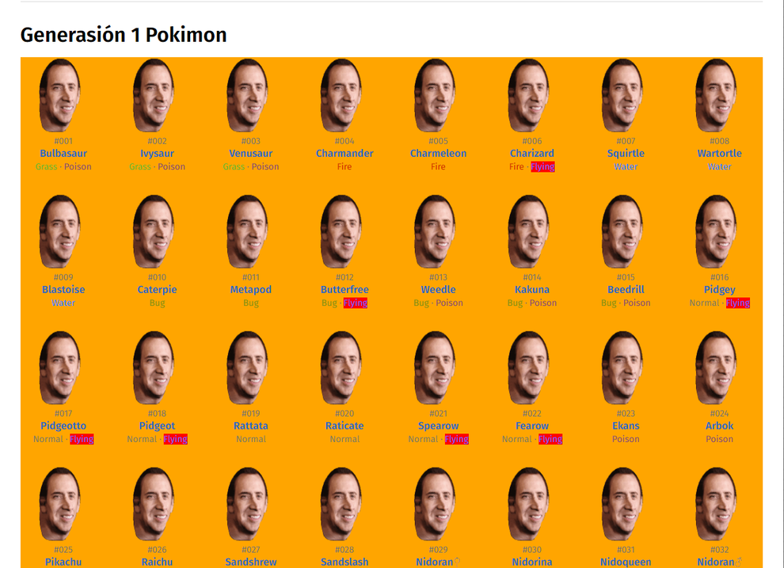

# **Bichomón**

## Consumo de pokeapi y modificación de imagen y estilos
[Enlace a la pokeapi](https://pokemondb.net/)

### Lenguajes utilizados:
- Javascript
- Html
- Css

### Explicación:
1. Se han sustituido las imágenes de los pokemon por un gif de la cara del actor Nicholas Cage como pequeña broma.
2. Todos los pokemon voladores se han señalado en color rojo.
3. Para manipular el DOM se ha utilizado queryselector.

